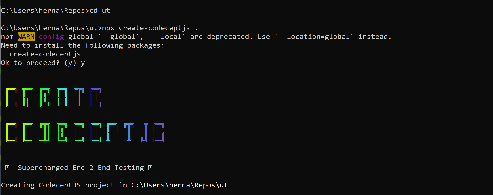
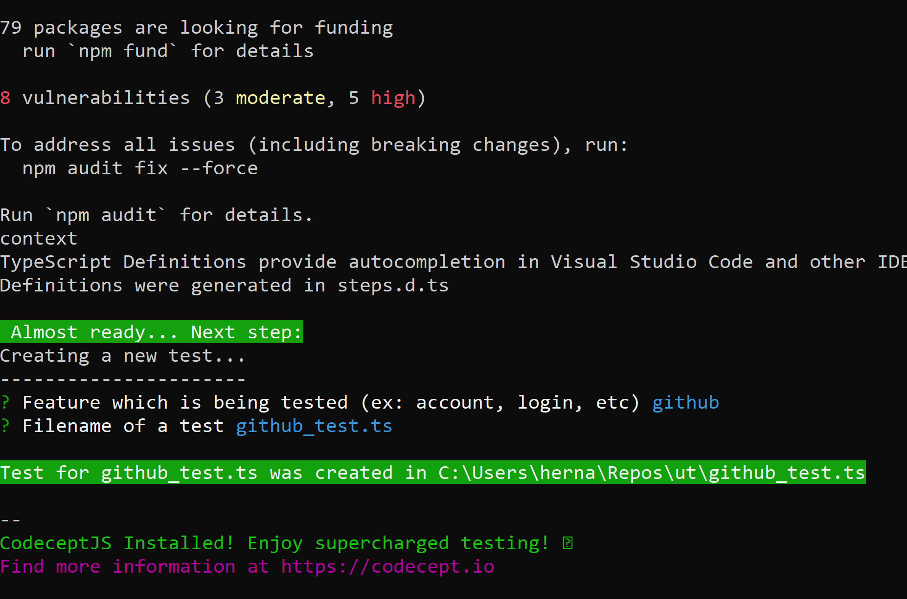
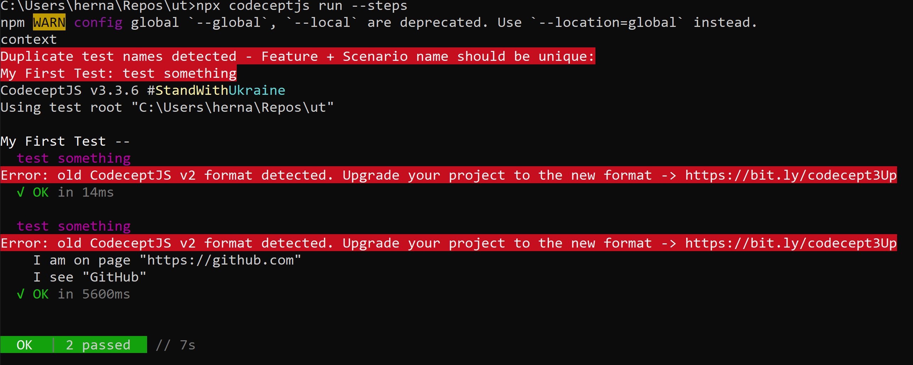
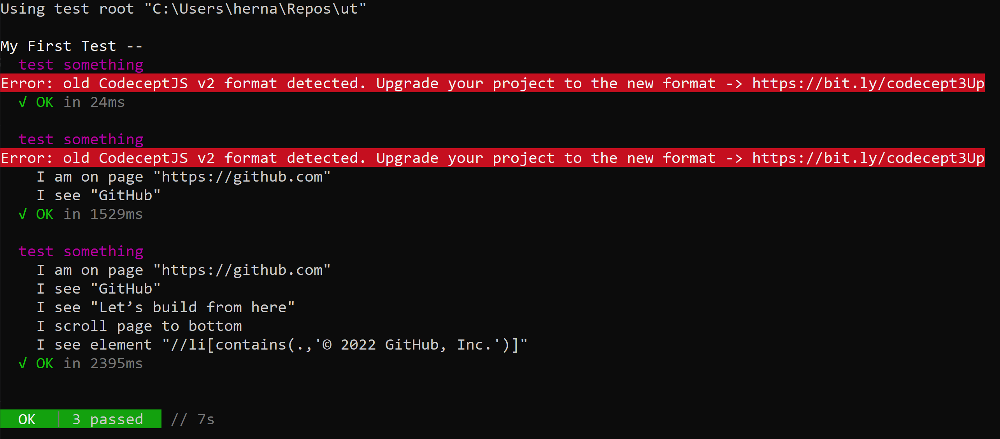
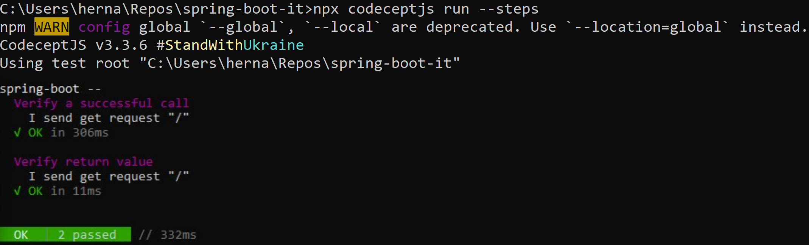
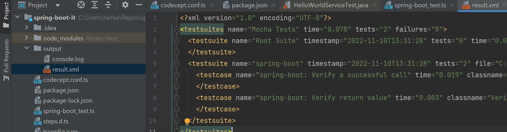

# Práctico 10

## 1- Familiarizarse con CodeceptJs
El objeto I cumple la funcion de actor que reemplaza a un usuario de testeo, permite realizar acciones de manera automatizada sobre la app.

## 2- Familiarizarse con CodeceptJs

Ahora corremos todos los test

## 3- Testeando la aplicación spring-boot

Test spring-boot-it

## 4- Habilitar reportes para utilizarlos en CICD

Test spring-boot-it

## 5- Integrar la ejecución en Jenkins
