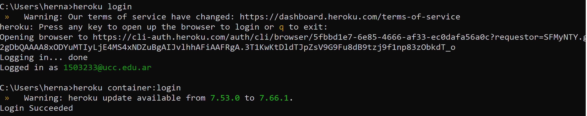
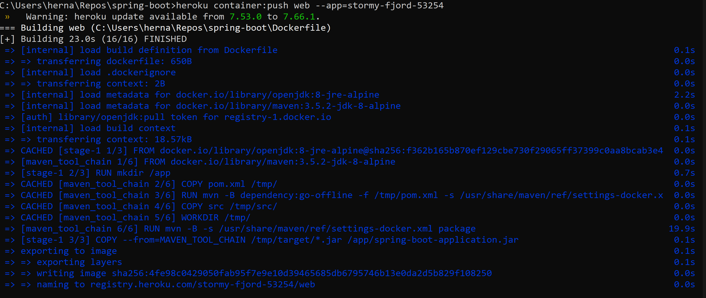
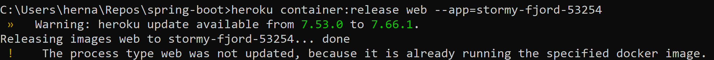
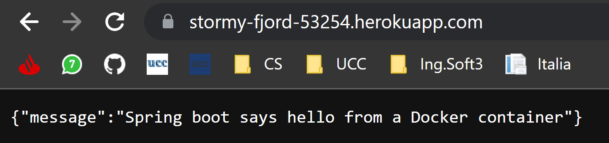

# Práctico 12

## 1- Configurando Heroku

## 2- Creando y Desplegando la aplicación Payroll
heroku container:release web --app=stormy-fjord-53254

Una vez terminada la operación, procedemos a desplegar la aplicación

Con esto vemos que está retornando el mensaje esperado.

## 3- Integrar el despliegue en Jenkins