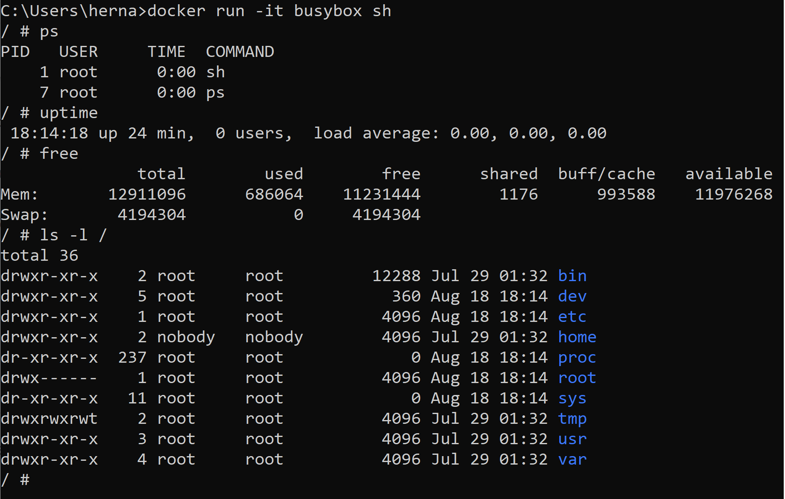
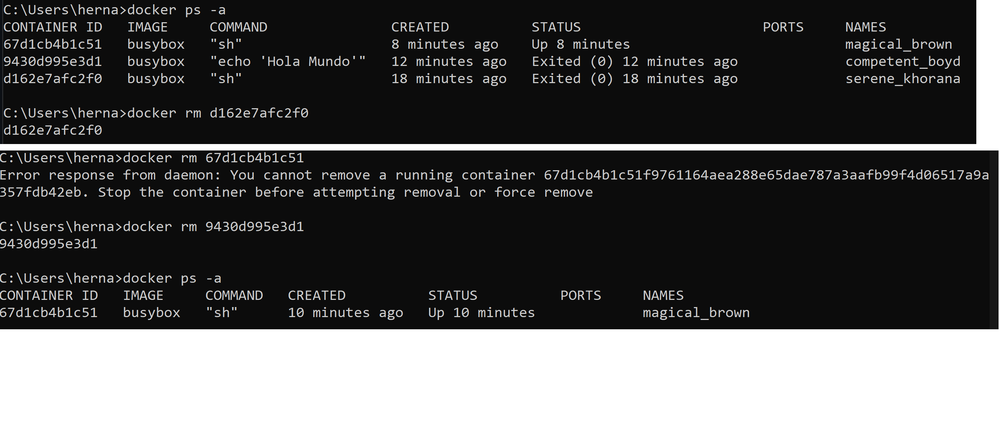
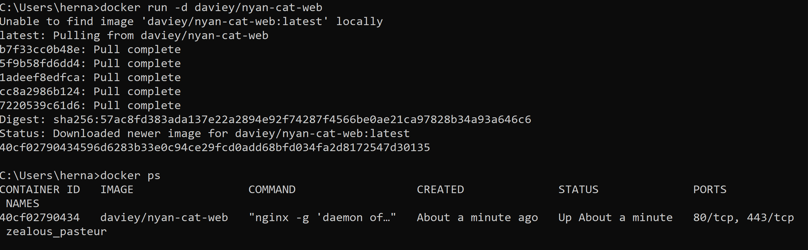
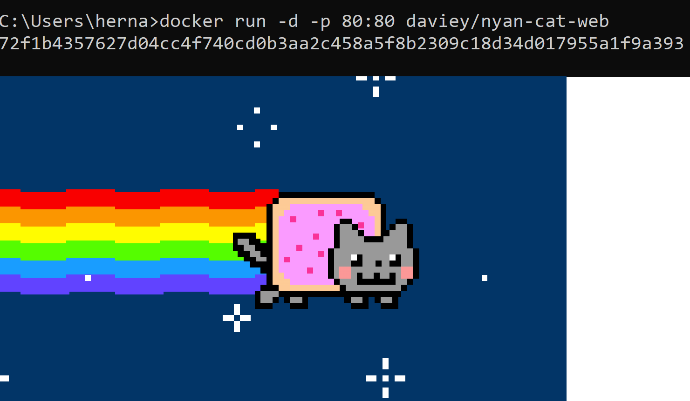
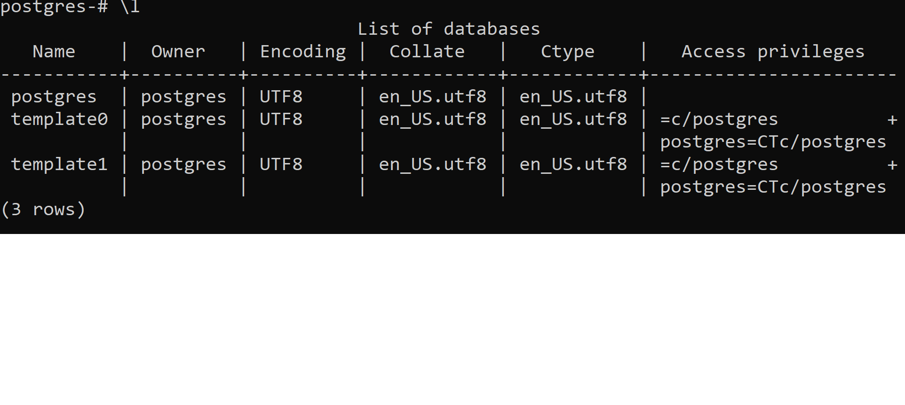
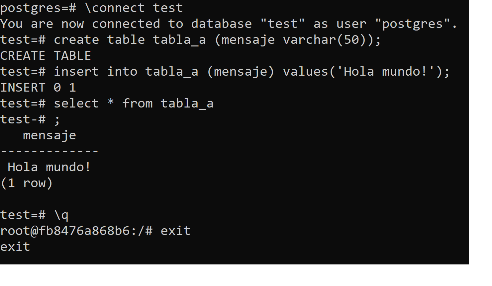

# Practico 2

## Punto 4:
    - No ocurre nada porque no ejecutamos el comando correcto.

## Punto 5:

## Punto 6:

## Punto 7:

## Punto 8:
Levantamos la imagen pero al no especificar el puerto, no nos muestra nada en LocalHost.

Ahora que le indicamos los puertos de comunicacion.

## Punto 9:

Descargamos una imagen de postgres 

Luego levantamos dicha imagen e interactuamos con postgres.

