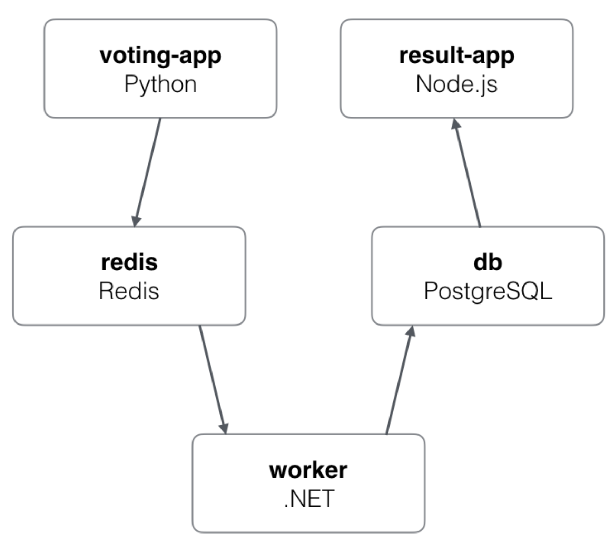

# Practico 3

## Punto 1:
    - Podemos ver que el puerto 5000 esta abierto.


    - Para ver los detalles utilize el comando que se visualiza en la imagen:


## Punto 2

A. Se trata de una API que esta conectada a la base de datos Redis y posee un contador que es incrementado al visitar el endpoint.

B. "–e" definen variables de entorno. En el punto anterior es utilizada para configurar el host y el puerto de Redis.

C. Si ejecuto docker rm -f web y vuelvo a correr ```docker run -d --net mybridge -e REDIS_HOST=db -e REDIS_PORT=6379 -p 5000:5000 --name web alexisfr/flask-app:latest``` estaría eliminando el contenedor y al volver a levantarlo el contador no se reiniciaría, ya que solo hemos borrado la app web.

D. Ahora, si ejecuto ``docker rm -f db`` y lo levanto nuevamente lograré borrar los hits registrados.

F. Guardar la informacion en un volumen de datos.

## Punto 3

Basicamente el "docker-compose.yml" es un archivo en el cual definimos los parametros para correr un docker predeterminado, donde le seteamos servicios, red, db.


## Punto 4

Analizando el "docker-compose", resumo que el sistema utiliza dos Apis:

front-tier, a través de la cuál se interconectan las apps de votación y resultados, utilizando websockets. back-tier, a través de la cuál éstas se comunican con redis y postgres. A su vez, el worker de java se comunica con estas últimas, actualizando postgres a partir de redis. La persistencia de datos de postgres se realiza sobre el volumen db-data.

Ambas Apis exponen su puerto 80 interno a través de los puertos 5000 y 5001 del host.

Procedimiento:
A. Voto de un usuario por 'localhost:5000' a la aplicación python.
B. La información del voto va desde la app de python a redis.
C. El worker de java esta observando la cola en redis, al momento en que ingresan votos los toma.
D. El worker ingresa a la db el voto tomado desde la cola.
F. La app node esta constantemente pidiendo los nuevos votos desde la db. 
G. La app node visualiza la cuenta de votos en 'localhost:5001'.

