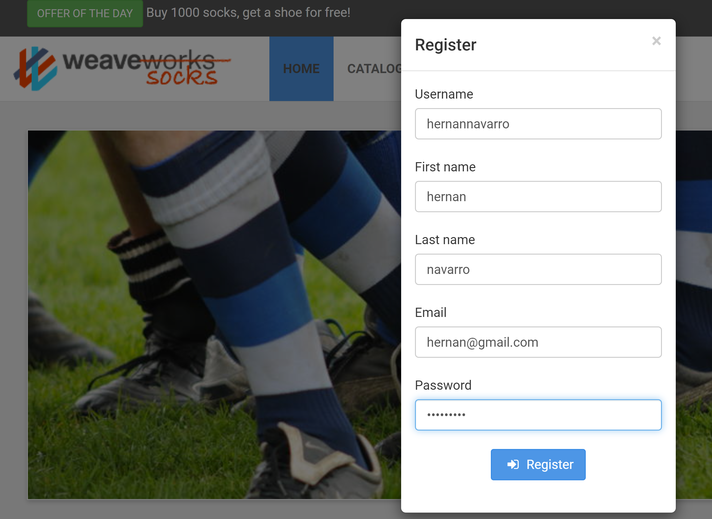
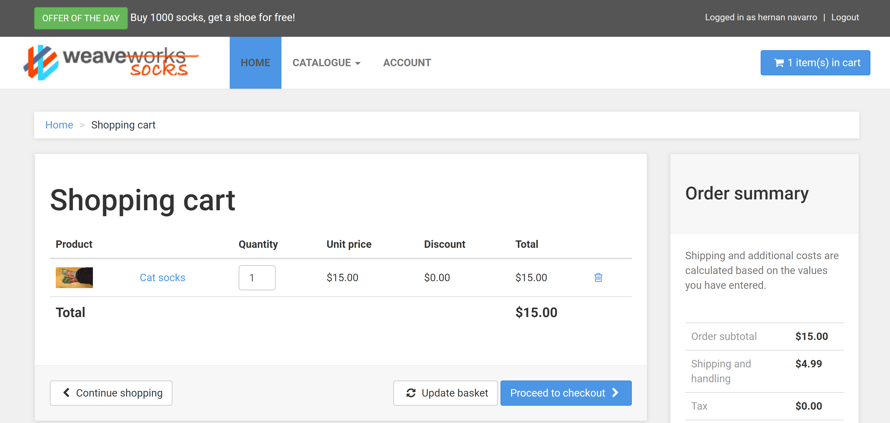
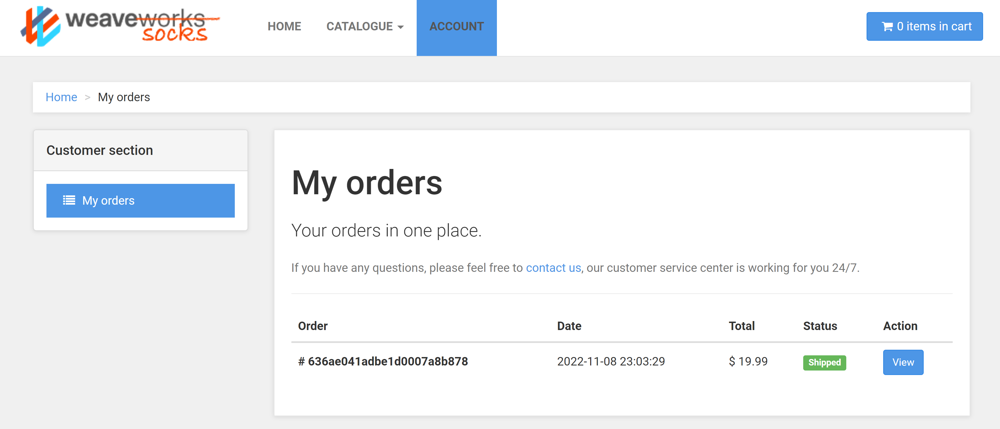
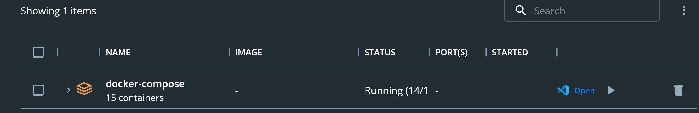
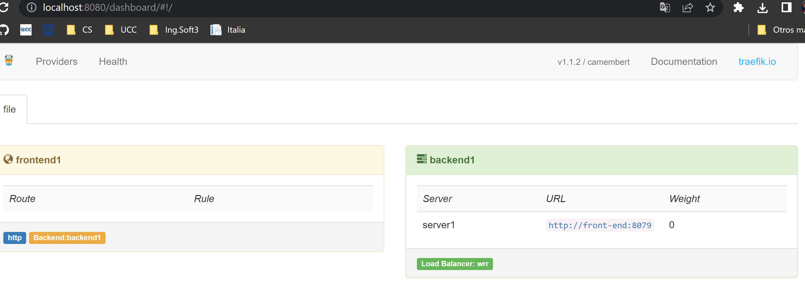

# Práctico 4

## 1-Instanciación del sistema:
    - Imagenes de la navegacion por la app.

## 2- Investigación de los componentes:
### 1.

    Una arquitectura de microservicios consta de una colección de servicios autónomos y pequeños. Estos servicios son independientes entre sí.

    El 'API Gateway' es el punto de entrada para los clientes. En lugar de llamar a los servicios directamente, los clientes llaman a la API Gateway, que reenvía la llamada a los servicios propiamente. La API Gateway es el ``edge-router`` que se implementa gracias a Traefik, es cual es un servicio de load balancing que se encarga de redireccionar los request que llegan sobre el puerto 80 hacia el container de front-end.

### 3.
    Se está utilizando repositorios separados por el concepto de microservicios.
    Entonces, se están utilizando repos distintos ya que de esta forma se puede tener un seguimiento del proceso y de los cambios que se realicen a servicios individuales. Así como también desplegarlos de forma independiente y así poder trabajar sobre ellos sin afectar a otros servicios. Y Como punto en contra está la complejidad la administración de los repositorios.

### 4.
    El contenedor Front-end hace las veces de API Gateway.

### 6.
    Primero, la request llega al 8080 en donde se encuentra con el edge-router. Es redireccionada hacia el servicio front-end. Luego, esta termina siendo procesada por el servicio ``User``

### 7.
    El procedimiento es el mismo solo que es procesada por el servicio ``Catalogue`` y ``Tags`` respectivamente.

### 8.
    Cada servicio que requiere persistencia de datos (Catalog, User, Tags) tiene un container acompañante el cual persiste los datos.

### 9.
    Queue-master

### 10.
    Se comunican por REST.