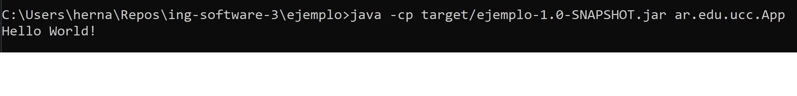

# Práctico 5

## 3-Introducción a Maven

### A.
Maven es una herramienta de software que se utiliza para facilitar la tarea de crear y administrar proyectos escritos en C#, Java, Ruby, etc. 
Siti oficial: ``“El objetivo principal de Maven es permitir que un desarrollador comprenda el estado completo de su trabajo en un período de tiempo más corto.”`` Para lograr este objetivo, Maven se ocupa de varias áreas de interés:

* Facilitando el proceso de construcción
* Proporcionar un sistema de construcción uniforme
* Proporcionar información de calidad sobre el proyecto
* Fomentar mejores prácticas de desarrollo

### B.
    POM -> Project Object Model.
    Es un archivo XML que reside en el directorio base del proyecto como pom.xml.
    
    El POM contiene información sobre el proyecto y varios detalles de configuración utilizados por Maven para construir los proyectos (build).

Debe haber un solo archivo POM para cada proyecto y sus elementos básicos son:
* modelVersion: versión del proyecto descripto en el POM. Mientras se use Maven 3 debe estar seteado en 4.0.0.
* groupId: Id del grupo de proyectos que lo identifica de entre todos los proyectos.
* artifactId: nombre del proyecto.
* versionId: Versión del proyecto. Junto con groupId, se usa dentro del repositorio de un artefacto (proyecto) para llevar un registro de los cambios en el código o las versiones.

### C.
En un repositorio de Maven se encuentran los proyectos, los cuales al estar estructurados de cierta forma permite hacer la descarga de las dependencias.
* Repositorio Local: es un directorio en la computadora que funciona como un caché para las descargas remotas y contiene artefactos de compilación temporales que son necesarios para la construcción del proyecto
* Repositorio Central: es un repositorio donde se guardan todos los componentes utilizados por la comunidad que trabaja con JDK
* Repositorio Remoto: hacen referencia a cualquier tipo de repositorio que puede ser accedido mediante protocolos como file:// y https:// para ser descargados e implementados

### D.
Un build es proporcionado por Maven con el objetivo de que el desarrollador logre realizar una gestión ágil y rápida de la configuración de su proyecto Maven, es un concepto abstracto que cubre todos los pasos que se espera que ocurran en la vida de desarrollo de un proyecto. Cuenta con tres ciclos de vida establecidos:
* 1-Default: Es el encargado del deployment del proyecto.
* 2-Clean: Es este ciclo se limpian los archivos y directorios generados por Maven durante el build.
* 3-Site: Es el ciclo encargado de la creación del proyecto y su documentación.

### F.
El comando `mvn clean install` generó el jar correspondiente al POM. Se sube el archivo.
No adjunto imagenes ya que subo el directorio generado.

## 4-Maven Continuación

Se creo un proyecto java a partir del template ar.edu.ucc, el cual se ha ejecutado exitosamente.

## 6-Manejo de Dependencias

