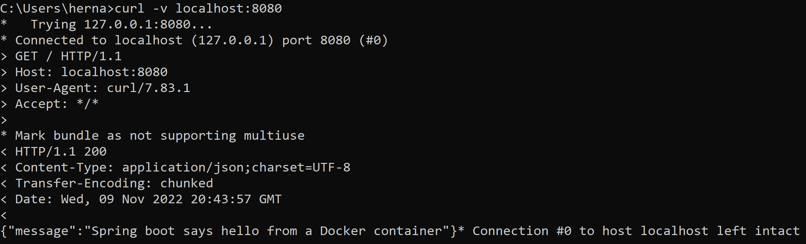
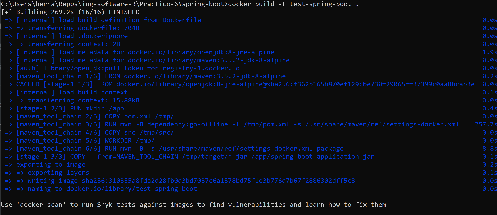
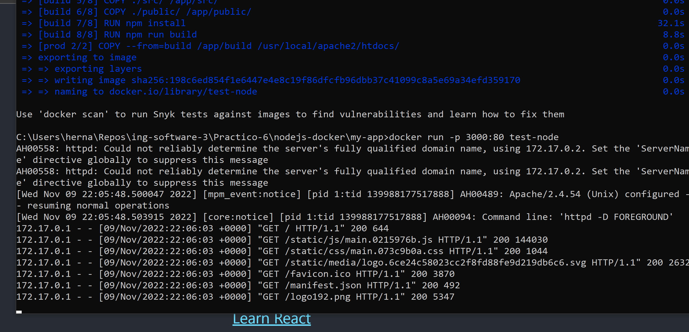
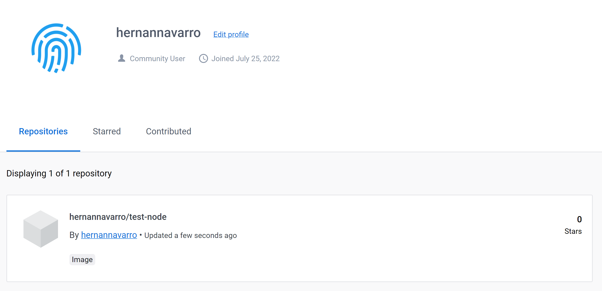

# Práctico 6

## 1- Conceptos de Dockerfiles
* FROM: inicializa una nueva etapa de construcción y establece la imagen base para instrucciones posteriores.
* RUN: ejecuta cualquier comando sobre la imagen deseada.
* ADD: copia archivos, directorios o URL de archivos remotos y los agrega al sistema de archivos de la imagen.
* COPY: copia archivos o directorios y los agrega al sistema de archivos del contenedor. (NO ARCHIVOS REMOTOS)
* EXPOSE: informa a Docker que el contenedor escucha en los puertos especificados durante su ejecución.
* CMD: proporciona valores predeterminados para un contenedor en ejecución. Solo puede haber una instrucción CMD en un Dockerfile.
* ENTRYPOINT: permite configurar un contenedor que se ejecutará como ejecutable.

## 2- Generar imagen de docker
Resultado de la ejecucion del curl. A tener en cuenta es que en el dockerfile se cambio:

``FROM java:8-jre-alpine`` por ``FROM openjdk:8-jre-alpine``


## 3- Dockerfiles Multi Etapas

* Comenzamos especificando aquellos archivos que se deben copiar para descargar las dependencias necesarias para la ejecución del sistema:
```
FROM maven:3.5.2-jdk-8-alpine AS MAVEN_TOOL_CHAIN
COPY pom.xml /tmp/
RUN mvn -B dependency:go-offline -f /tmp/pom.xml -s /usr/share/maven/ref/settings-docker.xml
```

* Se construye el proyecto copiando previamente los archivos fuente:
```
COPY src /tmp/src/
WORKDIR /tmp/
RUN mvn -B -s /usr/share/maven/ref/settings-docker.xml package
```

* Y se ejecuta la aplicación:
```
FROM openjdk:8-jre-alpine

EXPOSE 8080

RUN mkdir /app
COPY --from=MAVEN_TOOL_CHAIN /tmp/target/*.jar /app/spring-boot-application.jar

ENV JAVA_OPTS="-Xms32m -Xmx128m"

ENTRYPOINT exec java $JAVA_OPTS -Djava.security.egd=file:/dev/./urandom -jar /app/spring-boot-application.jar

HEALTHCHECK --interval=1m --timeout=3s CMD wget -q -T 3 -s http://localhost:8080/actuator/health/
```

## 4- Python Flask

Cuando ejecuto un docker-compose up -d en el directorio de la aplicación, se levanta dos servicios:
* Una app python 
* Una db redis 

``build.context``
Así se le define al servicio app donde tiene que utilizar el dockerfile que quiere utilizar
Lo cual se utiliza para definirle al servicio app donde debe buscar el dockerfile a utilizar.

## 5- Imagen para aplicación web en Nodejs


docker build -t test-node .

docker run -p 3000:80 test-node

## 6- Publicar la imagen en Docker Hub.

