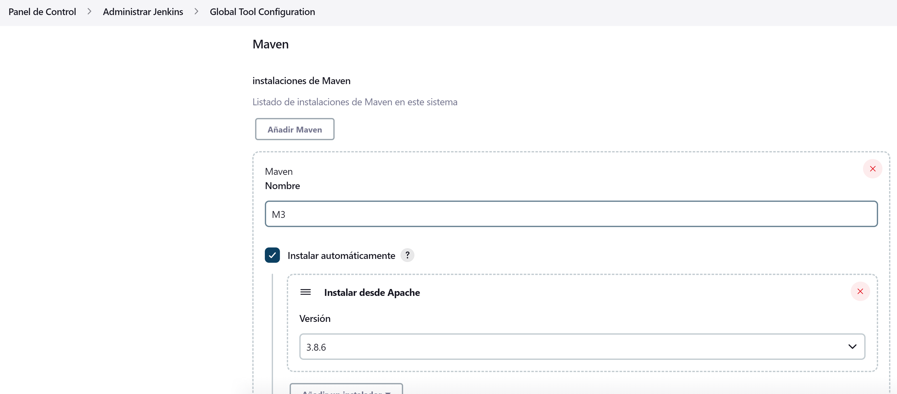

# Práctico 7

## 1- Poniendo en funcionamiento Jenkins

Jenkins funcionando


## 2- Conceptos generales
Jenkins, el servidor de automatización de código abierto líder, proporciona cientos de complementos para respaldar la creación, implementación y automatización de cualquier proyecto.

## 3- Instalando Plugins y configurando herramientas



## 4- Creando el primer Pipeline Job


Generó una lista de pasos que se llaman estados, donde el estado se llamaba Hello y corrió la task, entonces así puedo ir armando el pipeline.

## 5- Creando un Pipeline Job con Git y Maven


Lo que hace el código de "git + maven" es
1. Se descarga el repo de git.
2. Clean package. Esperamos un .jar de salida
3. Al final de la ejecucion va a juntar todos los resultados del test cases q se generan como parte de la ejecucion de ese clean package, usando el plugin Junit
4. archiveArtifacs va a guardar todo lo que se genera en la carpeta target directamente en Jenkins para que despues yo los pueda utilizar para algo.  Para bajarlo, o para pasarlo a otro Pipeline como entrada al artefacto.

Podemos ver que falla un test pero que se ejecuta correctamente le pipeline.


## 6- Utilizando nuestros proyectos
Ejecute el pipeline que primero fallo por una configuracion del script y luego resulto exitoso.


```
pipeline {
    agent any

    tools {
        maven "M3"
    }

    stages {
        stage('Build') {
            steps {
                git(url: 'https://github.com/hernanavarro/spring-boot.git', branch: 'main', poll: true)
                sh 'mvn -Dmaven.test.failure.ignore=true clean package'
            }

            post {
                success {
                    archiveArtifacts 'target/*.jar'
                }
            }
        }
    }
} 
```

7- Utilizando nuestros proyectos con Docker

```
pipeline {
    agent any

    environment { 
        registry = "hernannavarro/spring-boot" 
        registryCredential = 'docker-hub-credentials' 
    }
    
    
    stages {
        stage('Build') {
            steps {
                git(url: 'https://github.com/hernanavarro/spring-boot.git', branch: 'main', poll: true)
                sh 'docker build -t $registry:$BUILD_ID .'
            }
        }
        
        stage('Push image') {
            steps {
                withCredentials([usernamePassword( credentialsId: 'docker-hub-credentials', usernameVariable: 'USERNAME', passwordVariable: 'PASSWORD')]) {
                    script {
                        docker.withRegistry('', 'docker-hub-credentials') {
                            sh "docker login -u ${USERNAME} -p ${PASSWORD}"
                            sh "docker push $registry:$BUILD_ID"
                        }   
                    }
                }   
            }
        }
    }
} 
```