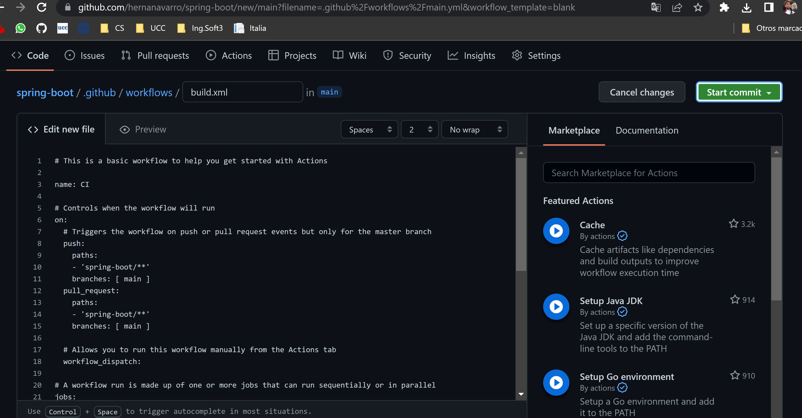
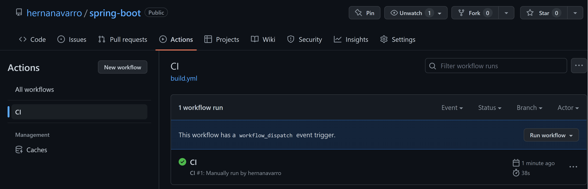
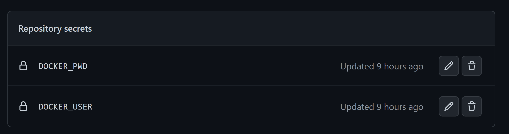
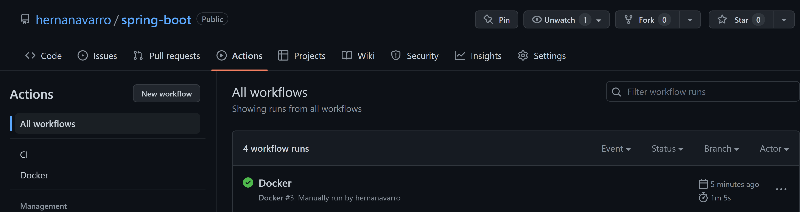

# Práctico 8

## 1- Pros y Contras
Las herramientas de integracion continua presentan multiples ventajas:
* Escalabilidad.
* Reducir la complejidad de proyectos: facilitan tareas de mantenimiento y actualización, automatizando la construccion del software en incrementos de menor tamano.
* Las pruebas automatizadas reducen el tiempo empleado para la deteccion de errores.

Desventajas:
* Las organizaciones que las implementen deberan confiar su proyecto y seguridad del mismo a tecnologias ajenas a ellas.
* La posibilidad de usarlas dependen de su disponibilidad, llevando asi a cierta dependencia de la organizacion y la herramienta.
* Los .yml correspondientes a cada herramienta se encuentran en el Repositorio Spring boot.

## 2- Configurando GitHub Actions

Se define la ruta donde esta el repo "spring-boot", luego se accede al repositorio a por medio de los jobs, despues se intala Java JDK8 con Maven, y se compila. Para finalmente correrla.

## 3- Utilizando nuestros proyectos con Docker
Secrets:

Ejecucion

