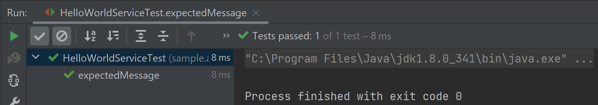
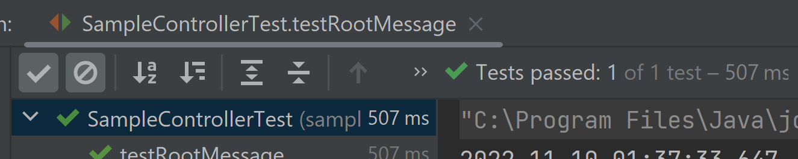
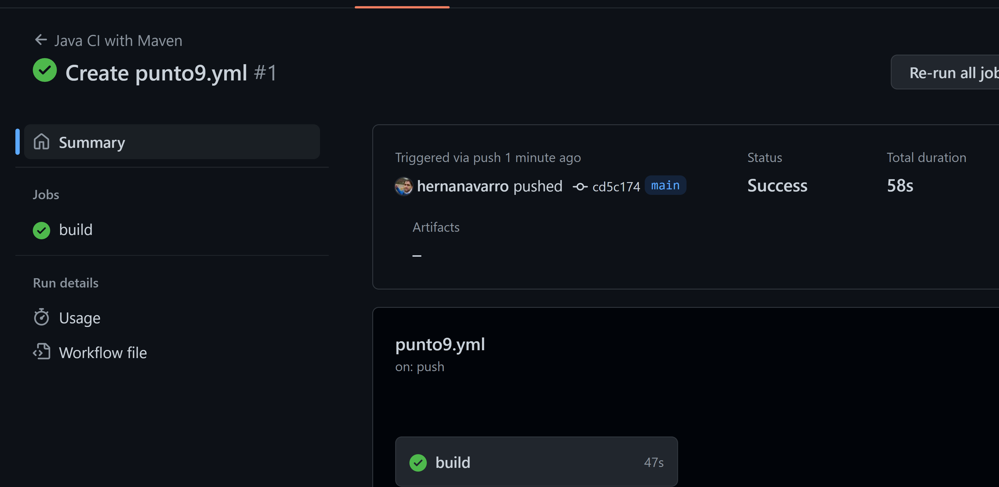

# Práctico 9

## 2- Utilizando Unit test
La dependencia en cuestion importa los modulos para tests, como por ejemplo JUnit, y otras librerias utiles para el proyecto.

La notacion @Test es la que le indica que es un caso de test. Y el assertEquals es la sentencia del test, se debe cumplir para que este sea exitoso.

## 3- Familiarizarse con algunos conceptos de Mockito
Analizando básicamente en el test podemos observar la utilización de mock que su función es crear escenario ficticio para poder testear la funcionalidad que se busca probar y cumplir así con el test.

## 4- Utilizando Mocks

Ahora el agregado de las clases "AbstractTest" y "SampleControllerTest" basicamente es un test que extiende de otro. El abstract por un lado mockea el contexto de la web app, y por otro es el test propio del controller a testear en cuestion. Se corre el test y resulta exitoso.

## 6- Capturar los unit tests como parte del proceso de CI/CD

